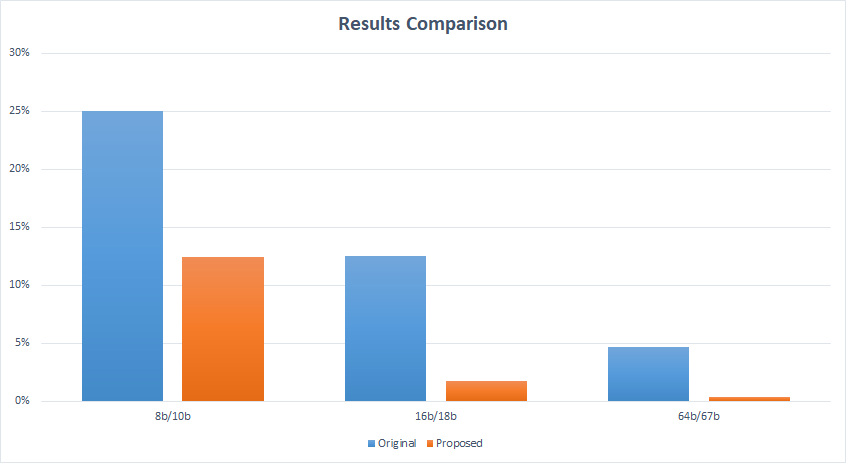

# Experimental Results

In order to evaluate the bit-overhead of the proposed method and compare them with those of the existing methods, we have performed intensive simulations for various line code parameters (i.e., the RL bound, the absolute RD bound, and S). 

## Comparing General Line Encoding Schemes

Here we will show few results to give an idea of the bit-overheads of various schemes compared to new proposed scheme.

**Experiment 1:**
Comparison with 8b/10b:

*Parameters:*
1. MAX_RL = 5
2. MAX_RD = 3
3. S-block = 2

Input data: The_quick_brown_fox_jumps_over_the_lazy_dog

Input bits Size: 344

*Results:*
1. Proposed Scheme
    * Output bits Size: 389
    * Bit-Overhead: 12.4277%

2. 8b/10b
    * Output bits Size: 430
    * Bit-Overhead: 25%

**Experiment 2:**

*Parameters:*
1. MAX_RL = 16
2. MAX_RD = 14
3. S-block = 12

Input data: _Lorem_ipsum_dolor_sit_amet,_class_vitae_vestibulum_at_in_inceptos,_velit_ante_enim_erat_pellentesque_varius,_suspendisse_tincidunt,_nec_tincidunt_dolor._Eget_mattis_adipiscing_ac_pellentesque_erat_suspendisse,_non_risus_leo_ullamcorper_vitae,_sociis_mattis_mollis_quis._Wisi_tincidunt_orci_scelerisque_ut,_morbi_parturient_varius_justo,_semper_nibh_eum_ante_risus_sed._Consequat_nec_maecenas,_leo_vel,_nibh_ullamcorper_pede._Fermentum_consequat_conubia_quam_mauris_massa,_sit_parturient_mi_elit,_sit_auctor,_ut_vel._Dignissim_curabitur_vivamus,_at_lacus,_amet_sit_dui_at_amet,_eu_interdum_morbi_aliquet_sit_mauris,_leo_enim_leo_netus_sit_pede_amet._Sociis_mattis_eu,_cursus_nunc,_ac_viverra,_turpis_dui_rerum_vitae_magna._Amet_mollis_eu_congue_etiam,_nam_vitae_tincidunt_nunc,_nec_eget_nam_mus_ac,_eget_pellentesque_odio_morbi_volutpat,_consectetuer_amet_vulputate._Dui_id_luctus,_odio_est_ornare_magni_dolor_fringilla,_sem_nibh_libero_odio_ipsum_dapibus,_minim_sed_erat_eget_est_vestibulum,_ut_aliquam._Nec_neque,_vestibulum_consequat,_ac_eget_ut_eu_nullam,_in_neque_dapibus_duis_ad_mus,_integer_nunc_vestibulum._Platea_nullam,_magna_nonummy_gravida_sapien_duis,_fringilla_in_quis_est,_enim_odio_et_faucibus_maecenas,_consequatur_ac_sociosqu_feugiat_cras_ut._Dolores_aenean_scelerisque_suscipit_viverra_duis_aenean,_elit_nascetur_adipiscing_facilisi_nec_magna,_sed_nunc_etiam_nulla_malesuada.

Input bits Size: 11144

*Results:*
1. Proposed Scheme
    * Output bits Size: 11472
    * Bit-Overhead: 2.9591%

**Experiment 3:**

Comparison with 16b/18b 

*Parameters:*
1. MAX_RL = 42
2. MAX_RD = 26
3. S-block = 30

Input data: _Lorem_ipsum_dolor_sit_amet,_class_vitae_vestibulum_at_in_inceptos,_velit_ante_enim_erat_pellentesque_varius,_suspendisse_tincidunt,_nec_tincidunt_dolor._Eget_mattis_adipiscing_ac_pellentesque_erat_suspendisse,_non_risus_leo_ullamcorper_vitae,_sociis_mattis_mollis_quis._Wisi_tincidunt_orci_scelerisque_ut,_morbi_parturient_varius_justo,_semper_nibh_eum_ante_risus_sed._Consequat_nec_maecenas,_leo_vel,_nibh_ullamcorper_pede._Fermentum_consequat_conubia_quam_mauris_massa,_sit_parturient_mi_elit,_sit_auctor,_ut_vel._Dignissim_curabitur_vivamus,_at_lacus,_amet_sit_dui_at_amet,_eu_interdum_morbi_aliquet_sit_mauris,_leo_enim_leo_netus_sit_pede_amet._Sociis_mattis_eu,_cursus_nunc,_ac_viverra,_turpis_dui_rerum_vitae_magna._Amet_mollis_eu_congue_etiam,_nam_vitae_tincidunt_nunc,_nec_eget_nam_mus_ac,_eget_pellentesque_odio_morbi_volutpat,_consectetuer_amet_vulputate._Dui_id_luctus,_odio_est_ornare_magni_dolor_fringilla,_sem_nibh_libero_odio_ipsum_dapibus,_minim_sed_erat_eget_est_vestibulum,_ut_aliquam._Nec_neque,_vestibulum_consequat,_ac_eget_ut_eu_nullam,_in_neque_dapibus_duis_ad_mus,_integer_nunc_vestibulum._Platea_nullam,_magna_nonummy_gravida_sapien_duis,_fringilla_in_quis_est,_enim_odio_et_faucibus_maecenas,_consequatur_ac_sociosqu_feugiat_cras_ut._Dolores_aenean_scelerisque_suscipit_viverra_duis_aenean,_elit_nascetur_adipiscing_facilisi_nec_magna,_sed_nunc_etiam_nulla_malesuada.

Input bits Size: 11144

*Results:*
1. Proposed Scheme
    * Output bits Size: 11663
    * Bit-Overhead: 1.7127%

2. 16b/18b
    * Output bits Size: 12537
    * Bit-Overhead: 12.5%

*Improvement:* 86.3%

**Experiment 4:**

Comparison with 64b/67b 

*Parameters:*

1. MAX_RL = 64
2. MAX_RD = 96
3. S-block = 132

Input data: _Lorem_ipsum_dolor_sit_amet,_class_vitae_vestibulum_at_in_inceptos,_velit_ante_enim_erat_pellentesque_varius,_suspendisse_tincidunt,_nec_tincidunt_dolor._Eget_mattis_adipiscing_ac_pellentesque_erat_suspendisse,_non_risus_leo_ullamcorper_vitae,_sociis_mattis_mollis_quis._Wisi_tincidunt_orci_scelerisque_ut,_morbi_parturient_varius_justo,_semper_nibh_eum_ante_risus_sed._Consequat_nec_maecenas,_leo_vel,_nibh_ullamcorper_pede._Fermentum_consequat_conubia_quam_mauris_massa,_sit_parturient_mi_elit,_sit_auctor,_ut_vel._Dignissim_curabitur_vivamus,_at_lacus,_amet_sit_dui_at_amet,_eu_interdum_morbi_aliquet_sit_mauris,_leo_enim_leo_netus_sit_pede_amet._Sociis_mattis_eu,_cursus_nunc,_ac_viverra,_turpis_dui_rerum_vitae_magna._Amet_mollis_eu_congue_etiam,_nam_vitae_tincidunt_nunc,_nec_eget_nam_mus_ac,_eget_pellentesque_odio_morbi_volutpat,_consectetuer_amet_vulputate._Dui_id_luctus,_odio_est_ornare_magni_dolor_fringilla,_sem_nibh_libero_odio_ipsum_dapibus,_minim_sed_erat_eget_est_vestibulum,_ut_aliquam._Nec_neque,_vestibulum_consequat,_ac_eget_ut_eu_nullam,_in_neque_dapibus_duis_ad_mus,_integer_nunc_vestibulum._Platea_nullam,_magna_nonummy_gravida_sapien_duis,_fringilla_in_quis_est,_enim_odio_et_faucibus_maecenas,_consequatur_ac_sociosqu_feugiat_cras_ut._Dolores_aenean_scelerisque_suscipit_viverra_duis_aenean,_elit_nascetur_adipiscing_facilisi_nec_magna,_sed_nunc_etiam_nulla_malesuada.

Input bits Size: 11144

*Results:*

1. Proposed Scheme
    * Output bits Size: 11188
    * Bit-Overhead: 0.394548%

2. 16b/18b
    * Output bits Size: 11666
    * Bit-Overhead: 4.687%

*Improvement:* 91.6%

**Ploted Comparisons**

